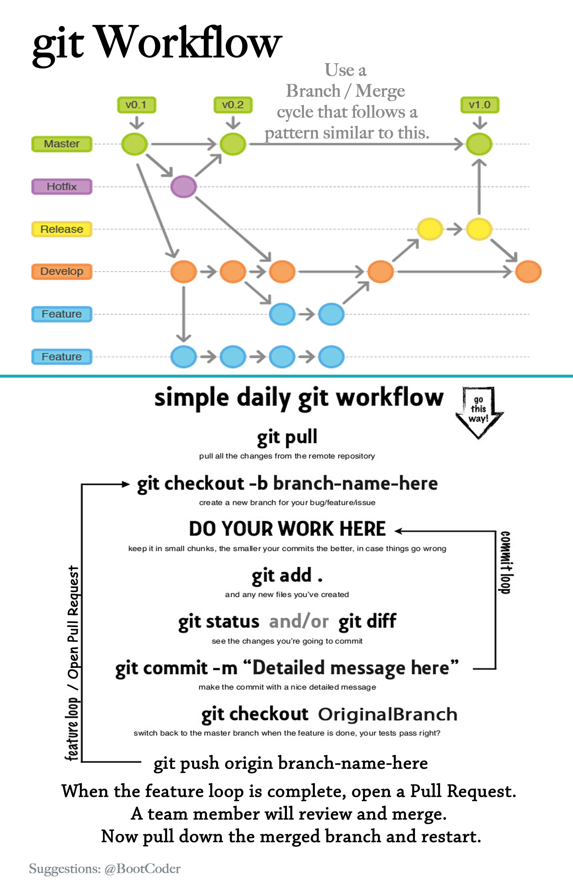

# Tips && Tricks

## For the JR Dev in your life.

**Literally** every thing below is IMHO

It's a lot of data in one spot so use the TOC. You don't have to read it all in one go, actually you don't have to read it at all. Really this is just a spot where I have collected little things that I think make my life as a Dev better...

## Table of Contents
  - [How to Search Google](#how-to-google-search)
  - [Sublime Shortcuts](#sublime-shortcuts)
  - [Code Readability](#code-readability)
  - [File Organization](#file-organization)
  - [Software Suggestions](#software)
  - [Config Options](#config-stuff)
  - [Stuff Everbody Should Know](#stuff-everybody-should-know)
  - [Links](#links)

### Symbol Guide
  - ⌘ – Command Key
  - ⇥ – Tab Key
  - ⌃ – Control Key
  - ⌥ – Option Key
  - ⇧ – Shift Key
  - ⏎ – Return

---

### Pro Tip Numero Uno

__HANDS OFF THE F*&^%ING MOUSE!!!__

As a developer your time is a __Super Valuable Resource__...

So every little thing you can do to increase efficiency will pay vast dividends over the course of your career.

You rarely need to actually touch the mouse. Every time you do you must take your hands completely off the keyboard. Grab the mouse. Go click the thing, then transfer back to the keyboard, find the home-row and finally start typing again...Precious seconds that add up to a huge savings every day.

It won't be easy but start building this skill now. Force yourself to leave the mouse behind. You're better than that mouse. You don't need no stinkin mouse. You have *Dev Hands*!!!

Also long term mouse usage can lead to RSI which is a seriously legit thing to avoid.

**MORAL OF THE STORY**

```⌘ p``` in Sublime is hands down the fastest way to get around a working directory. Each application should be opened in its own sublime window ( subl . from command line @ application root)

Side Note: Speeding up your search with a no mouse approach is crazy efficient.
---

### Attitude Matters

[Start Here](http://blog.hiphipjorge.com/tips-for-learning-programming/)

A lot actually. Coding as a career is essentially solving difficult puzzles through your editor everyday. Remember to maintain the correct attitude during your career as a dev. We are super fortunate to be in an industry which allows us to play as we work. No I don't mean ping pong or cornhole. I mean play with your puzzle. Maintain a joyous and fun level of interaction between your brain, your fingers and whatever is going on the screen. If you approach every challenge / feature / project with a poke / play attitude you will go much further and actually enjoy yourself as you do. *Gasp*

Remain calm. For real. It sounds so simple and easy yet this easy simple thing is totally taken for granted. When you are not calm as a developer you lose the ability to focus logically on your code. You open yourself up to deep superego rabbit holes and you greatly reduce the efficiency of yourself as a developer. Establish this as a strong mental protocol by enforcing an internal state of happy play time.

Example:

When facing an increasing difficult coding challenge I do not say to myself

### *ARRRR this is really hard, I don't know what to do, how do I even start, maybe I'm not good enough...


But rather something like

### *Sweet!!! Boss Level Challenge. I'm going to earn a shitload of XP. Something I don't know, Sweet!!! gonna level up like crazy. Ok I wonder what happens if I do X, nope OK, what about Y....*


Also worth noting here is opposite side of the coin. If you allow yourself to look upon this work as a strenuous endeavor... If you start a new problem and think 'OMG this is gonna be soooooo hard || How the F do I even begin to figure this out', you are setting yourself up for a bad time. If you gaze upon a problem with negative eyes you are only granting a perfect stage for your superego to come out and kick your ass. So.... Don't do that!

---

### How to Google Search

Super high on the list of most important things you will learn here.

Enter a search term then quickly parse over 4-5 results to narrow down your scope.

#### DEPENDENCY NOTE:

The functionality detailed below is no longer supported in Chrome by default. :-(

Get this [extension](https://chrome.google.com/webstore/detail/google-search-keyboard-sh/iobmefdldoplhmonnnkchglfdeepnfhd) to restore it. :-)

#### Search Process:

See rule number 1. Any time you are leaving the keyboard you are losing time.
  - ⌘ + t -- open a new tab
  - Enter search terms. The first word of your search should always be the language you are looking for.
  - ⏎ -- to search google
  - tab this will take focus from the search bar and place it in the results list. You know you're there because a little blue arrow will appear next to the first result.
  - open the first 5 links into new tabs
    - ⌘ + ⏎ -- to open link
    - down arrow -- to go to next link
    - Repeat until you have a decent cross section of suggestions from the internet. (I usually do like 5)
  - Cycle through newly opened tabs using

    ⌘ + ⇧ + {

    ⌘ + ⇧ + }

  - ⌘ + w -- Close unwanted tabs

  - Profit

  You should practice this process until you are at a point that you can research a particular thing in like 20 seconds.

#### Search Tips:

- The first word of any search should be the name of the language you are working in.
- Leave out non technical words you might use to explain your question to a human.
- Keep your query as small and clean as possible.
- Train your eye to look at the dates when you are doing the arrow thing to open results. Get used to skipping the older links in your first pass.

Ex: ruby gsub escaped characters

Ex: ruby remove formatting characters

VS:

!Ex: How do I get rid of special characters in a string?

!Ex: remove special formatting from ruby string

---

### Don't think, KNOW!!!

Writing code is like being a puppy. Life is just better when you p on everything.

When generating or debugging your code always know what things are evaluating to.
- If you're unsure, __p it out.__
- If you think you know but maybe don't, __p it out.__
- If you're wondering if you made it inside some conditional block, __p it out.__
- If you haven't confirmed that you're even in the file you think you are, __p it out.__
- If you can't remember, __p it out.__
- If, If If, (whatever), __p it out.__

P'ing your variables is so important, I made a gem to help.


```ruby
gem install extra_print
```

[Documentation](https://github.com/bootcoder/extra_print)

---


### Sublime Shortcuts
[Complete List](http://sublime-text-unofficial-documentation.readthedocs.org/en/latest/reference/keyboard_shortcuts_osx.html)

Super useful ones
- move lines vertically ``` ⌘ + ⌃ ```
- jump to file ``` ⌘ + p + (fuzzy file name) ```
- global search ``` ⌘ + ⇧ + f ```
- duplicate line ``` ⌘ + ⇧ + d ```
- select word (and repeat) ``` ⌘ + d ```
- commenting code ``` ⌘ + / ```
- jump to line ``` ⌘ + p + : + (line number (int)) ```

---

### Copy & Paste Like a PRO!!!!!!!!!!!!

AKA: DO NOT STRAIGHT COPY CODE!!!!!

Don't just go to the INTERNET and find some answer on StackOverflow to paste into your code. This leads to a problem known as _CopyPasta_ which is what happens when you paste in a bunch of code without having rewritten it for yourself. You forget to change a variable here, or access something out of scope there...... Pasting in code that leads to more time spent debugging is a losing trade.

I'm not telling you to not use code you find at all. What I am suggesting is this.

```ruby
def some_method_i_will_write

end

# def some_method_pasted_in
#   some_logic_i_need.each do |thing|
#     p thing
#   end
# end
```
Paste the code in and __IMMEDIATELY__ comment it out. Then use the commented code as a reference to build the desired functionality from scratch. Once you are done erase the paste and move along.

Benefits include:
  - No issues with improper variable naming.
  - Increased Muscle Memory.
  - Helps ensure that you understand the code as it is implemented.

---

### Keep your working window clean.

A clean working screen is super clutch.

You should always have your windows configured such that you can see the editor and the terminal without having to click around. I prefer a 66/33 split between the editor and terminal. Like so


 Using Spectacle is the easiest way to accomplish this. The point being that as a Ruby Dev you are looking at the Terminal __A LOT__. So keeping it in a spot that is visible all the time is really useful from an efficiency standpoint. Much easier to just glance at your terminal for output as opposed to having to switch over and then find the output.

 Auto hiding the Doc can provide some more screen estate. Having the Dock take up a pretty big chunk of your screen is bad, especially on widescreen displays, where the Dock sits at the bottom and eats away precious height. Alt-Click the black bar to open preferences, then check auto-hide.

---

### Take care of yourself

This job can be very grueling. Your personal sanity is a thing you should be mindful of always.
  - Always remember __You are not your Code__
  - Eat well
  - Exercise often
  - Yoga is great
  - **During DBC** Get the sleep you need to maintain functionality
  - **After DBC** Work life balance  is super important
  - Talk to yourself... A LOT, you are your own best sounding board

### Take care of your pair
  - They're fragile too.
  - Ensuring they are not left behind ensures you are rock solid.
  - A happy pair will allow a much stronger learning environment for both of you.

---

### Follow the Golden Rule of BLOCKS

[Everything that has a __BEGINNING__ has an __END__](https://www.youtube.com/watch?v=UHCXsF6Kgvc)

Write the end as soon as you write the beginning and save your self loads of frustration counting def-end combos later.

```ruby
def thing_func
end
```

```ruby
thingy.each do
end
```

```ruby
some_hash = { }
some_array = [ ]
```

---

### Code readability

You've heard people say that coding is an art form... This has to do with that.

Indentation - OMG do this. I will look at you funny if your code structure is all jacked up. Indent properly all the time. Don't leave the line without ensuring it is indented correctly. Lots of languages are whitespace dependent, meaning you are forced to indent correctly. Better to establish this habit now. No I don't mean get good at using Sublime auto re-indent command. I mean actually establish a habit of indenting correctly on your own. Preferable with tabs set to 2. :-)

Limit the length of your lines to 80 characters.
A neat way to remember this is to set a ruler in Sublime User settings.
```"rulers": [80]```

__Code readability BEATS conciseness 10.times out of 10__

This means writing functions that are easy for developers to read. Not just you, but future you and the people that maintain your code down the road.

Don't one line a thing because you want to look cool.

Don't leave a bunch of unnecessary comments or debugging print statements in your code at time of commit.


---

### File Organization
Good habits when it comes to naming and storing files is something that will pay off big time for you in the long run.

Don't keep your files on the desktop.

Spend some time to figure out a good file structure that works for you. Once you make a plan stick to it. Down the road you will have  away easier time tracking down projects because they will have been placed in to your structure by some standard of your creation.

Here is a sample of what a well organized file structure looks like.
```bash
Main Folder
├── 1Phase
│   ├── 1Week
│   ├── 2week
│   ├── 3Week
│   ├── assesments
│   ├── breakouts
│   ├── general
│   └── phase-1-guide
├── 2Phase
│   ├── 4week
│   ├── 5week
│   ├── 6week
│   ├── assessments
│   ├── guides
│   ├── other
│   └── p-challenges
├── 3Phase
│   ├── challenges
│   ├── other
│   ├── phase-3-guide
│   └── someshit
├── hackathons
│   ├── notes.md
│   ├── pitches.md
│   ├── schedule.md
│   └── team_leads.md
├── lectures
│   ├── 1phase
│   └── 2phase
├── other
│   ├── Ruby-Anagrams
│   ├── devbootcamp.github.io
│   ├── hemlock
│   ├── node_sample2
│   ├── react-7guis
│   ├── retros
│   └── rspec_rails_4
```

---

### Git Workflow



---

### NO SUDO NO (IDCare what the INTERNET tells you)
Short and sweet. If you are using ```sudo``` to install something on your mac....

__You're doing it WRONG__

- Ask for help.
- When installing something, check for a homebrew formula as your first option.

**Disclaimer** There are times when ```sudo``` is the only way, like when installing homebrew, but you should try to avoid it and really really reallllllly be sure you absolutely need it before you go that route.

---

## Software

### First and Foremost
Everything in this section should be taken with a grain of salt.

__DO NOT__ go and install everything you see here. Look over, file away, take what works and leave the rest. If you don't understand it or what it does __DO NOT INSTALL__, this as it turns out is a pretty good policy in general.

### Chrome Extensions
[Big List O Recommendations](https://github.com/bootcoder/htc_dev_settings/blob/master/chrome_extensions.md)

### Spotlight || Alfred for system navigation
  - Use Spotlight ⌘ + spacebar to search your system for files and applications.

### Hot Key your iTerm2
```⌘ + \``` is what I use.

Also.... Use iTerm2 instead of terminal.

Get comfy with the pref's here.
  - Increase buffer size
  - Increase Transparency
  - Make a jazzy color scheme that works for you and you alone.

## Sublime

### Packages
  * Package Manager
  * SideBarEnhancements
  * Better CoffeeScript
  * All Autocomplete
  * BracketHighlighter
  * Markdown HTML Preview
  * GitGutter
  * ERB Snippets
  * Haml
  * JSLint
  * PowerCursors
  * SublimeLinter
  * SublimeLinter-haml
  * TernJS
  * Theme - Tech49
  * Color Scheme - Tomorrow Night

### Linters
The good the bad and the ugly

Pros
  - help you see errors in your code
  - give you tips on best practices
  - easy to use

Cons
  - can cause stability issues with Sublime
  - others best practices may not always align with your own.

### APPS (osx)
  - Flycut (clipboard management)
  - Spectacle (window management)
  - Dropbox
  - Alfred (configure to replace spotlight)
  - Dash
  - Hub
  - iTerm2
  - PostMan REST Client

### Gems (Don't even think about this list till late phase 2 minimum.)
  - bropages(gem)
  - haml
  - guard-rspec
  - guard-livereload
  - guard-spork
  - pry-byebug
  - pry-doc
  - better_errors
  - binding_of_caller
  - dotenv

### Editors

  - __Sublime__ (my preference)
  - __Atom__
  - __VIM__

  If one of these is not your go to option you are denying yourself valuable resources on many fronts.

  - As an OSX user you have a kickass development environment on your computer.
  - Not knowing how to navigate that environment can be a serious detriment on the job.
  - These editors have a metric ton of keyboard shortcuts that can greatly increase your efficiency as a dev.

Remote editors like:

  - __REPL.it__
  - __Nitrious.io__
  - __Coderpad.io__

are nice... But come with some distinct drawbacks.

  - Great for remote work and demonstrating concepts.
  - Using them in a pair environment or on the job is just doubling the amount of work you have to do.
  - Don't have access to all the very cool candy that Sublime gives you.
  - Only really good for single page scripts.
  -Difficult to program a server in a virtual environment.
  - No Git workflow interface
  - Slows down ability to continuously integrate code.

---

## Config Stuff

### BASH TIPS
  Your mileage may vary depending on how you have your BASH configured.

  - If you want to find and execute a command that you know you've executed before, try using Ctrl + R and start typing any part of the command. You'll get filtered results that let you narrow them down to the command you're looking for.

  - history then !(int) to fire that command
  - man + / for search
  - fn + leftArrow || fn + rightArrow key for front or end of line

### BASH Aliases
These are the aliases that I use.
```bash
alias e=subl
alias be="bundle exec"
alias g=git
alias cl=clear
alias ga="git ca"
alias gpo="git push origin"
alias gph="git push heroku"
alias rials="rails"
alias gti="git"
alias shitgun="shotgun"
alias shotfun="shotgun"
alias dbc="cd ~/Dropbox/ACODE/DBC/dayJerbs"
alias code="cd ~/Dropbox/ACODE/adBC
```

### GIT Config
```bash
[core]
  # Excludesfiles allows us to set a global list of things to ignore
  # Great place for things like .env or secrets.yml
  excludesfile = ~/.gitignore_global

# These are custom color options for the console
[color]
  status = auto
  diff = auto

[color "status"]
  untracked = cyan
  changed = green
  added = yellow

# Aliases are command shortcuts
[alias]

  # lg is now a shortcut for a pretty log with short commit messages
  # See the log manpage: https://www.kernel.org/pub/software/scm/git/docs/git-log.html
  # for explanations of what these options do

  lg = log --graph --pretty=format:'%Cred%h%Creset -%C(yellow)%d%Creset %s %Cgreen(%cr) %C(bold blue)<%an>%Creset' --abbrev-commit --date=relative

  # Shorthand for a less noisy status
  s = commit --dry-run --short

  # More sensible names for adding and removing files from the readme
  stage = add
  unstage = reset HEAD

  # Edit the last commit
  amend= commit --verbose --amend

  # one-line log
  l = log --pretty=format:"%C(yellow)%h\\ %ad%Cred%d\\ %Creset%s%Cblue\\ [%cn]" --decorate --date=short

  a = add
  ap = add -p
  c = commit --verbose
  ca = commit -a --verbose
  cm = commit -m
  cam = commit -a -m
  m = commit --amend --verbose

  d = diff
  ds = diff --stat
  dc = diff --cached

  co = checkout
  cob = checkout -b

  # list branches sorted by last modified
  b = "!git for-each-ref --sort='-authordate' --format='%(authordate)%09%(objectname:short)%09%(refname)' refs/heads | sed -e 's-refs/heads/--'"

  # list aliases
  la = "!git config -l | grep alias"
[user]
  email = bootcoder@gmail.com
  name = BootCoder
[credential]
  helper = cache --timeout=14400

```

The last line (credential), is super nice. This sets the timeout between authentication for a GitHub push.

### Sublime User Settings

This is lifted directly from my sublime user settings.

DO NOT COPY PASTE!!!

Just a reference for you, as with everything else here, analyze first, then make
a decision about what works for you to implement.
```bash
{
  "atomic_save": false,
  "bold_folder_labels": true,
  "caret_style": "phase",
  "color_scheme": "Packages/User/SublimeLinter/Tomorrow-Night (SL).tmTheme",
  "draw_white_space": "selection",
  "ensure_newline_at_eof_on_save": true,
  "fade_fold_buttons": false,
  "font_face": "Inconsolata",
  "font_size": 21,
  "highlight_line": true,
  "ignored_packages":
  [
    "Emmet",
    "PlainTasks",
    "RubyTest",
    "Theme - Farzher",
    "Vintage"
  ],
  "line_padding_bottom": 1,
  "line_padding_top": 1,
  "rulers":
  [
    80
  ],
  "save_on_focus_lost": true,
  "spell_check": true,
  "tab_size": 2,
  "theme": "Tech49.sublime-theme",
  "translate_tabs_to_spaces": true,
  "trim_trailing_white_space_on_save": true
}

```

---

### After you graduate from DBC
Never **EVER** refer to yourself as a 'JR Developer'

You are better than that. There is no situation in which pigeonholing
yourself into a JR role is a positive.

Also, your __SUPER EGO__ has absolutely no place in your

- job search,
- interview process,
- salary negotiations
- day to day life as a Dev.

History has shown that you are, upon graduation competent enough to compete
with Mid-Level Devs from anywhere. And in fact a lot BETTER than many of the
Devs you will meet in the workforce. Believe it! Make it your reality and
knock 'all the things' out of all the parks at all the times.

---

### Stuff Everybody Should Know

Laurie Voss is a co-founder @ NPM. He gave this excellent talk a while back at DBC SF.

Contrary to my standard advice, I would recommend every boot watch this talk @ 1X speed instead of the usual 1.5..2.5X.

Fair warning this talk is over 2 hours. So get comfy, grab a snack and take some notes.

[Video Link](https://www.youtube.com/edit?o=U&video_id=fjtn3KCi17Y)

---

### Links

[Tips for JR Devs](https://blog.newrelic.com/2014/04/23/better-junior-developer/)

[10 Tips to transition from JR to MID level Dev](http://www.techrepublic.com/blog/software-engineer/10-tips-to-go-from-a-beginner-to-an-intermediate-developer/)

[Increase your Jr Dev Cred](https://www.codementor.io/learn-programming/15-ways-to-improve-as-a-junior-developer)

[explainshell](http://explainshell.com/)

---

### Contributing:

If you want to contribute in general I'm super open to it, as well as any feedback you might have.

Process:

- fork it
- clone it
- branch it
- contribute
- push up your branch to your fork
- open a pull request back here to master

As to the subject matter itself, if you don't agree in my choice of software that's awesome!

But for seriouslies, I'm not saying I don't care about or appreciate how much better ```INSERT RANDO SOFTWARE TITLE HERE``` is. I'm just saying I've heard... it's cool. No need to track me down, shake me around and pontificate furiously whilst cycling through the virtues of ```INSERT RANDO SOFTWARE TITLE HERE```.

---

### Last but not least

Make XKCD your homepage. *Seriously*
